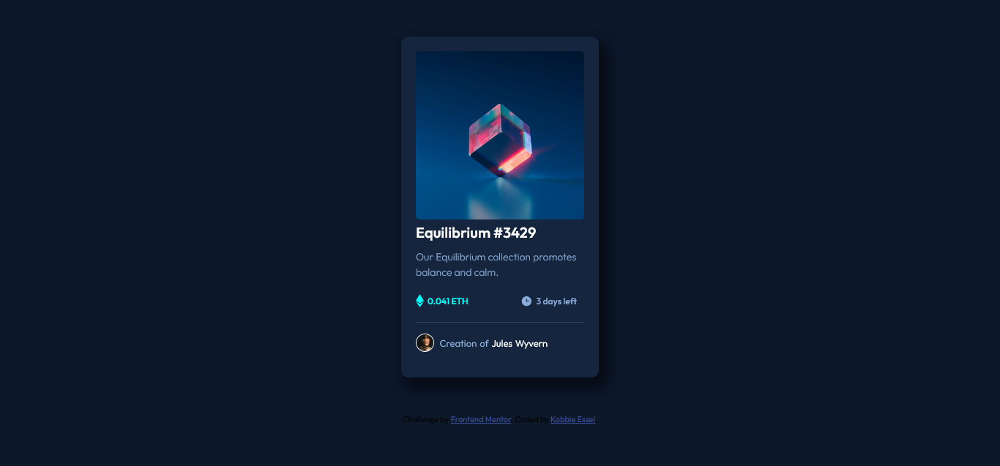

# Frontend Mentor - NFT preview card component solution

This is a solution to the [NFT preview card component challenge on Frontend Mentor](https://www.frontendmentor.io/challenges/nft-preview-card-component-SbdUL_w0U). Frontend Mentor challenges help you improve your coding skills by building realistic projects.

## Table of contents

- [Overview](#overview)
  - [The challenge](#the-challenge)
  - [Screenshot](#screenshot)
  - [Links](#links)
  - [Built with](#built-with)
  - [What I learned](#what-i-learned)
- [Author](#author)

## Overview

### The challenge

Build out this preview card component
Users should be able to:

- View the optimal layout depending on their device's screen size
- See hover states for interactive elements

### Screenshot



### Links

- Solution URL: (https://github.com/kobbieessel/nft-preview-card)
- Live Site URL:(https://kobbieessel.github.io/nft-preview-card/)

### Built with

- Semantic HTML5 markup
- CSS
- Flexbox

### What I learned

I learnt
how to use classes and flex box.

```css
    <div class="date-container">
        
        <p>3 days left</p>
    </div>
```

```css
.date-container {
  padding: 0 5px;
  display: flex;
  flex-direction: row;
  align-items: center;
  justify-content: space-between;
}
```

how to create overlay effect,how to use the position attribute and the difference between relative and absolute and how to use them.

```css
.image1 {
  position: relative;
  width: inherit;
  display: flex;
  justify-content: center;
  align-items: center;
  border-radius: 5px;
  overflow: hidden;
}
```

```css
.overlay {
  position: absolute;
  top: 0;
  left: 0;
  right: 0;
  bottom: 0;
  width: inherit;
  background-color: hsla(178, 100%, 50%, 0.5);
  opacity: 0;
  display: flex;
  justify-content: center;
  align-items: center;
  transition: 1s ease-in-out;
}
```

## Author

- Frontend Mentor - [@kobbieessel](https://www.frontendmentor.io/profile/kobbieessel)
- Twitter - [@McselKobbie](https://www.twitter.com/McselKobbie)
